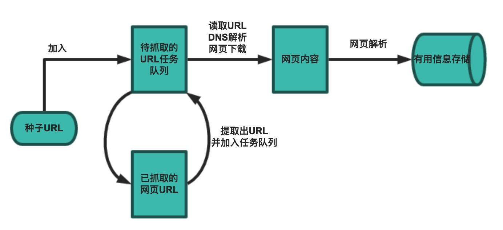

# 网络爬虫


## 前提知识

#### Robots.txt文件

Robots是站点与spider沟通的重要渠道，站点通过robots文件声明本网站中不想被搜索引擎收录的部分或者指定搜索引擎只收录特定的部分 

robots.txt文件应该放置在网站根目录下 举例来说，当spider访问一个网站（比如 http://www.abc.com）时，首先会检查该网站中是否存在http://www.abc.com/robots.txt这个文件，如果 Spider找到这个文件，它就会根据这个文件的内容，来确定它访问权限的范围 

淘宝的[robots.txt](http://www.taobao.com/robots.txt)

```json
User-agent: Baiduspider        #User-agent:该项的值用于描述搜索引擎robot的名字
Allow:  /article               #Allow:该项的值用于描述希望被访问的一组URL
Disallow: /				       #Disallow:该项的值用于描述不希望被访问的一组URL
```


### 爬虫工具

1. 下载数据 - **urllib** / **requests** / **aiohttp** / **httpx** 
2. 解析数据 - **re** / **lxml** / **beautifulsoup4** / **pyquery** 
3. 缓存和持久化 - **mysqlclient** / **sqlalchemy** / **peewee** / **redis** / **pymongo** 
4. 生成数字签名 - **hashlib** 
5. 序列化和压缩 - **pickle** / **json** / **zlib** 
6. 调度器 - **multiprocessing** / **threading** / **concurrent.futures** 


## 爬虫框架

一个基本的爬虫通常分为数据采集(网页下载)、数据处理(网页解析)和数据存储(将有用的信息持久化)三个部分的内容，更为高级的爬虫在数据采集和处理时会使用并发编程或分布式技术，这就需要有调度器(安排线程或进程执行对应的任务)、后台管理程序(监控爬虫的工作状态以及检查数据抓取的结果)等的参与.



一般来说，爬虫的工作流程包括以下几个步骤：

1. 设定抓取目标（种子页面/起始页面）并获取网页 
2. 当服务器无法访问时，按照指定的重试次数尝试重新下载页面 
3. 在需要的时候设置用户代理或隐藏真实IP，否则可能无法访问页面 
4. 对获取的页面进行必要的解码操作然后抓取出需要的信息 
5. 在获取的页面中通过某种方式（如正则表达式）抽取出页面中的链接信息 
6. 对链接进行进一步的处理（获取页面并重复上面的动作） 
7. 将有用的信息进行持久化以备后续的处理 


**下面的例子给出了一个从“搜狐体育”上获取NBA新闻标题和链接的爬虫** 

```python
import re
from collections import deque
from urllib.parse import urljoin

import requests

LI_A_PATTERN = re.compile(r'<li class="item">.*?</li>')
A_TEXT_PATTERN = re.compile(r'<a\s+[^>]*?>(.*?)</a>')
A_HREF_PATTERN = re.compile(r'<a\s+[^>]*?href="(.*?)"\s*[^>]*?>')


def decode_page(page_bytes, charsets):
    """通过指定的字符集对页面进行解码"""
    for charset in charsets:
        try:
            return page_bytes.decode(charset)
        except UnicodeDecodeError:
            pass


def get_matched_parts(content_string, pattern):
    """从字符串中提取所有跟正则表达式匹配的内容"""
    return pattern.findall(content_string, re.I) \
        if content_string else []


def get_matched_part(content_string, pattern, group_no=1):
    """从字符串中提取跟正则表达式匹配的内容"""
    match = pattern.search(content_string)
    if match:
        return match.group(group_no)


def get_page_html(seed_url, *, charsets=('utf-8', )):
    """获取页面的HTML代码"""
    resp = requests.get(seed_url)
    if resp.status_code == 200:
        return decode_page(resp.content, charsets)


def repair_incorrect_href(current_url, href):
    """修正获取的href属性"""
    if href.startswith('//'):
        href = urljoin('http://', href)
    elif href.startswith('/'):
        href = urljoin(current_url, href)
    return href if href.startswith('http') else ''


def start_crawl(seed_url, pattern, *, max_depth=-1):
    """开始爬取数据"""
    new_urls, visited_urls = deque(), set()
    new_urls.append((seed_url, 0))
    while new_urls:
        current_url, depth = new_urls.popleft()
        if depth != max_depth:
            page_html = get_page_html(current_url, charsets=('utf-8', 'gbk'))
            contents = get_matched_parts(page_html, pattern)
            for content in contents:
                text = get_matched_part(content, A_TEXT_PATTERN)
                href = get_matched_part(content, A_HREF_PATTERN)
                if href:
                    href = repair_incorrect_href(href)
                print(text, href)
                if href and href not in visited_urls:
                    new_urls.append((href, depth + 1))


def main():
    """主函数"""
    start_crawl(
        seed_url='http://sports.sohu.com/nba_a.shtml',
        pattern=LI_A_PATTERN,
        max_depth=2
    )


if __name__ == '__main__':
    main()
```


通过上面的例子，我们对爬虫已经有了认识，在编写爬虫时有以下一些注意事项：

1. 上面的代码使用了`requests`三方库来获取网络资源，这是一个非常优质的三方库，关于它的用法可以参考它的[官方文档](https://requests.readthedocs.io/zh_CN/latest/) 

2. 上面的代码中使用了双端队列（`deque`）来保存待爬取的URL 双端队列相当于是使用链式存储结构的`list`，在双端队列的头尾添加和删除元素性能都比较好，刚好可以用来构造一个FIFO（先进先出）的队列结构 

3. 处理相对路径 有的时候我们从页面中获取的链接不是一个完整的绝对链接而是一个相对链接，这种情况下需要将其与URL前缀进行拼接（`urllib.parse`中的`urljoin()`函数可以完成此项操作） 

4. 设置代理服务 有些网站会限制访问的区域（例如美国的Netflix屏蔽了很多国家的访问），有些爬虫需要隐藏自己的身份，在这种情况下可以设置使用代理服务器，代理服务器有免费的服务器和付费的商业服务器，但后者稳定性和可用性都更好，强烈建议在商业项目中使用付费的商业代理服务器 如果使用`requests`三方库，可以在请求方法中添加`proxies`参数来指定代理服务器；如果使用标准库，可以通过修改`urllib.request`中的`ProxyHandler`来为请求设置代理服务器 

5. 限制下载速度 如果我们的爬虫获取网页的速度过快，可能就会面临被封禁或者产生“损害动产”的风险（这个可能会导致吃官司且败诉），可以在两次获取页面数据之间添加延时从而对爬虫进行限速 

6. 避免爬虫陷阱 有些网站会动态生成页面内容，这会导致产生无限多的页面（例如在线万年历通常会有无穷无尽的链接） 可以通过记录到达当前页面经过了多少个链接（链接深度）来解决该问题，当达到事先设定的最大深度时，爬虫就不再像队列中添加该网页中的链接了 

7. 避开蜜罐链接 网站上的有些链接是浏览器中不可见的，这种链接通常是故意诱使爬虫去访问的蜜罐，一旦访问了这些链接，服务器就会判定请求是来自于爬虫的，这样可能会导致被服务器封禁IP地址 如何避开这些蜜罐链接我们在后面为大家进行讲解 

8. SSL相关问题 如果使用标准库的`urlopen`打开一个HTTPS链接时会验证一次SSL证书，如果不做出处理会产生错误提示“SSL: CERTIFICATE_VERIFY_FAILED”，可以通过以下两种方式加以解决：

   - 使用未经验证的上下文

     ```python
     import ssl
     
     request = urllib.request.Request(url='...', headers={...}) 
     context = ssl._create_unverified_context()
     web_page = urllib.request.urlopen(request, context=context)
     ```

   - 设置全局性取消证书验证

     ```python
     import ssl
     
     ssl._create_default_https_context = ssl._create_unverified_context
     ```

     

## 数据采集

**Requests爬取数据**

1. GET请求和POST请求 

   ```python
   import requests
   
   resp = requests.get('http://www.baidu.com/index.html')
   print(resp.status_code)
   print(resp.headers)
   print(resp.cookies)
   print(resp.content.decode('utf-8'))
   
   resp = requests.post('http://httpbin.org/post', data={'name': 'Hao', 'age': 40})
   print(resp.text)
   data = resp.json()
   print(type(data))
   ```

2. URL参数和请求头 

   ```python
   resp = requests.get(
       url='https://movie.douban.com/top250',
       headers={
           'User-Agent': 'Mozilla/5.0 (Macintosh; Intel Mac OS X 10_14_6) '
                         'AppleWebKit/537.36 (KHTML, like Gecko) '
                         'Chrome/83.0.4103.97 Safari/537.36',
           'Accept': 'text/html,application/xhtml+xml,application/xml;'
                     'q=0.9,image/webp,image/apng,*/*;'
                     'q=0.8,application/signed-exchange;v=b3;q=0.9',
           'Accept-Language': 'zh-CN,zh;q=0.9,en;q=0.8',
       }
   )
   print(resp.status_code)
   ```

3. 复杂的POST请求（文件上传） 

   ```python
   resp = requests.post(
   	url='http://httpbin.org/post',
       files={'file': open('data.xlsx', 'rb')}
   )
   print(resp.text)
   ```

4. 操作Cookie 

   ```python
   cookies = {'key1': 'value1', 'key2': 'value2'}
   resp = requests.get('http://httpbin.org/cookies', cookies=cookies)
   print(resp.text)
   
   jar = requests.cookies.RequestsCookieJar()
   jar.set('tasty_cookie', 'yum', domain='httpbin.org', path='/cookies')
   jar.set('gross_cookie', 'blech', domain='httpbin.org', path='/elsewhere')
   resp = requests.get('http://httpbin.org/cookies', cookies=jar)
   print(resp.text)
   ```

5. 设置代理服务器 

   ```python
   requests.get('https://www.taobao.com', proxies={
       'http': 'http://10.10.1.10:3128',
       'https': 'http://10.10.1.10:1080',
   })
   ```

   > **说明**：关于`requests`库的相关知识，还是强烈建议大家自行阅读它的[官方文档](https://requests.readthedocs.io/zh_CN/latest/) 

6. 设置请求超时 

   ```python
   requests.get('https://github.com', timeout=10)
   ```


## 页面解析

**几种解析方式的比较**

| 解析方式       | 对应的模块    | 速度   | 使用难度 | 备注                                    |
| -------------- | ------------- | ------ | -------- | --------------------------------------- |
| 正则表达式解析 | re            | 快     | 困难     | 常用正则表达式 在线正则表达式测试       |
| XPath解析      | lxml          | 快     | 一般     | 需要安装C语言依赖库 唯一支持XML的解析器 |
| CSS选择器解析  | bs4 / pyquery | 不确定 | 简单     |                                         |

> **说明**：`BeautifulSoup`可选的解析器包括：Python标准库中的`html.parser`、`lxml`的HTML解析器、`lxml`的XML解析器和`html5lib`。


### 使用正则表达式解析页面

**用正则表达式解析“豆瓣电影Top250”中的中文电影名称**

```python
import random
import re
import time

import requests

PATTERN = re.compile(r'<a[^>]*?>\s*<span class="title">(.*?)</span>')

for page in range(10):
    resp = requests.get(
        url=f'https://movie.douban.com/top250?start={page * 25}',
        headers={
            'User-Agent': 'Mozilla/5.0 (Macintosh; Intel Mac OS X 10_14_6) '
                          'AppleWebKit/537.36 (KHTML, like Gecko) '
                          'Chrome/83.0.4103.97 Safari/537.36',
            'Accept': 'text/html,application/xhtml+xml,application/xml;'
                      'q=0.9,image/webp,image/apng,*/*;'
                      'q=0.8,application/signed-exchange;v=b3;q=0.9',
            'Accept-Language': 'zh-CN,zh;q=0.9,en;q=0.8',
        },
    )
    items = PATTERN.findall(resp.text)
    for item in items:
        print(item)
    time.sleep(random.randint(1, 5))
```


### XPath解析和lxml

XPath是在XML文档中查找信息的一种语法，它使用路径表达式来选取XML文档中的节点或者节点集。这里所说的XPath节点包括元素、属性、文本、命名空间、处理指令、注释、根节点等。

```xml
<?xml version="1.0" encoding="UTF-8"?>
<bookstore>
    <book>
      <title lang="eng">Harry Potter</title>
      <price>29.99</price>
    </book>
    <book>
      <title lang="zh">三国演义</title>
      <price>39.95</price>
    </book>
</bookstore>
```

对于上面的XML文件，我们可以用如下所示的XPath语法获取文档中的节点。

| 路径表达式      | 结果                                                         |
| --------------- | ------------------------------------------------------------ |
| bookstore       | 选取 bookstore 元素的所有子节点。                            |
| /bookstore      | 选取根元素 bookstore。注释：假如路径起始于正斜杠( / )，则此路径始终代表到某元素的绝对路径！ |
| bookstore/book  | 选取属于 bookstore 的子元素的所有 book 元素。                |
| //book          | 选取所有 book 子元素，而不管它们在文档中的位置。             |
| bookstore//book | 选择属于 bookstore 元素的后代的所有 book 元素，而不管它们位于 bookstore 之下的什么位置。 |
| //@lang         | 选取名为 lang 的所有属性。                                   |

在使用XPath语法时，还可以使用XPath中的谓词。

| 路径表达式                         | 结果                                                         |
| ---------------------------------- | ------------------------------------------------------------ |
| /bookstore/book[1]                 | 选取属于 bookstore 子元素的第一个 book 元素。                |
| /bookstore/book[last()]            | 选取属于 bookstore 子元素的最后一个 book 元素。              |
| /bookstore/book[last()-1]          | 选取属于 bookstore 子元素的倒数第二个 book 元素。            |
| /bookstore/book[position()<3]      | 选取最前面的两个属于 bookstore 元素的子元素的 book 元素。    |
| //title[@lang]                     | 选取所有拥有名为 lang 的属性的 title 元素。                  |
| //title[@lang='eng']               | 选取所有 title 元素，且这些元素拥有值为 eng 的 lang 属性。   |
| /bookstore/book[price>35.00]       | 选取 bookstore 元素的所有 book 元素，且其中的 price 元素的值须大于 35.00。 |
| /bookstore/book[price>35.00]/title | 选取 bookstore 元素中的 book 元素的所有 title 元素，且其中的 price 元素的值须大于 35.00。 |

XPath还支持通配符用法，如下所示。

| 路径表达式   | 结果                              |
| ------------ | --------------------------------- |
| /bookstore/* | 选取 bookstore 元素的所有子元素。 |
| //*          | 选取文档中的所有元素。            |
| //title[@*]  | 选取所有带有属性的 title 元素。   |

如果要选取多个节点，可以使用如下所示的方法。

| 路径表达式                       | 结果                                                         |
| -------------------------------- | ------------------------------------------------------------ |
| //book/title \| //book/price     | 选取 book 元素的所有 title 和 price 元素。                   |
| //title \| //price               | 选取文档中的所有 title 和 price 元素。                       |
| /bookstore/book/title \| //price | 选取属于 bookstore 元素的 book 元素的所有 title 元素，以及文档中所有的 price 元素。 |

**用XPath解析“豆瓣电影Top250”中的中文电影名称**

```python
from lxml import etree

import requests

for page in range(10):
    resp = requests.get(
        url=f'https://movie.douban.com/top250?start={page * 25}',
        headers={
            'User-Agent': 'Mozilla/5.0 (Macintosh; Intel Mac OS X 10_14_6) '
                          'AppleWebKit/537.36 (KHTML, like Gecko) '
                          'Chrome/83.0.4103.97 Safari/537.36',
            'Accept': 'text/html,application/xhtml+xml,application/xml;'
                      'q=0.9,image/webp,image/apng,*/*;'
                      'q=0.8,application/signed-exchange;v=b3;q=0.9',
            'Accept-Language': 'zh-CN,zh;q=0.9,en;q=0.8',
        }
    )
    html = etree.HTML(resp.text)
    spans = html.xpath('/html/body/div[3]/div[1]/div/div[1]/ol/li/div/div[2]/div[1]/a/span[1]')
    for span in spans:
        print(span.text)
```


### BeautifulSoup的使用

BeautifulSoup是一个可以从HTML或XML文件中提取数据的Python库, 它能够通过你喜欢的转换器实现惯用的文档导航、查找、修改文档的方式。

**用CSS选择器解析“豆瓣电影Top250”中的中文电影名称**

```python
import random
import time

import bs4
import requests

for page in range(10):
    resp = requests.get(
        url=f'https://movie.douban.com/top250?start={page * 25}',
        headers={
            'User-Agent': 'Mozilla/5.0 (Macintosh; Intel Mac OS X 10_14_6) '
                          'AppleWebKit/537.36 (KHTML, like Gecko) '
                          'Chrome/83.0.4103.97 Safari/537.36',
            'Accept': 'text/html,application/xhtml+xml,application/xml;'
                      'q=0.9,image/webp,image/apng,*/*;'
                      'q=0.8,application/signed-exchange;v=b3;q=0.9',
            'Accept-Language': 'zh-CN,zh;q=0.9,en;q=0.8',
        },
    )
    soup = bs4.BeautifulSoup(resp.text, 'lxml')
    elements = soup.select('.info>div>a')
    for element in elements:
        span = element.select_one('.title')
        print(span.text)
    time.sleep(random.random() * 5)
```


## 数据存储

**使用MySQL来保存从知乎发现上爬取到的链接和页面**

1. 数据库初始化

```sql
create database zhihu default charset utf8;
create user 'hellokitty'@'%' identified by 'Hellokitty.618';
grant all privileges on zhihu.* to 'hellokitty'@'%';
flush privileges;

use zhihu;
create table `tb_explore`
(
	`id` integer auto_increment,
    `url` varchar(1024) not null,
    `page` longblob not null,
    `digest` char(48) unique not null,
    `idate` datetime default now(),
    primary key (`id`)
);
```

2. 实例代码

```python
import hashlib
import pickle
import re
import zlib
from urllib.parse import urljoin

import MySQLdb
import bs4
import requests

conn = MySQLdb.connect(host='1.2.3.4', port=3306,
                       user='hellokitty', password='Hellokitty.618',
                       database='zhihu', charset='utf8',
                       autocommit=True)


def write_to_db(url, page, digest):
    try:
        with conn.cursor() as cursor:
            cursor.execute(
                'insert into tb_explore (url, page, digest) values (%s, %s, %s) ',
                (url, page, digest)
            )
    except MySQLdb.MySQLError as err:
        print(err)


def main():
    base_url = 'https://www.zhihu.com/'
    seed_url = urljoin(base_url, 'explore')
    headers = {'user-agent': 'Baiduspider'}
    try:
        resp = requests.get(seed_url, headers=headers)
        soup = bs4.BeautifulSoup(resp.text, 'lxml')
        href_regex = re.compile(r'^/question')
        for a_tag in soup.find_all('a', {'href': href_regex}):
            href = a_tag.attrs['href']
            full_url = urljoin(base_url, href)
            digest = hashlib.sha1(full_url.encode()).hexdigest()
            html_page = requests.get(full_url, headers=headers).text
            zipped_page = zlib.compress(pickle.dumps(html_page))
            write_to_db(full_url, zipped_page, digest)
    finally:
        conn.close()


if __name__ == '__main__':
    main()
```


## 数据缓存

我们已经知道了如何从指定的页面中抓取数据，以及如何保存抓取的结果，但是我们没有考虑过这么一种情况，就是我们可能需要从已经抓取过的页面中提取出更多的数据，重新去下载这些页面对于规模不大的网站倒是问题也不大，但是如果能够把这些页面缓存起来，对应用的性能会有明显的改善。

**使用Redis来缓存知乎发现上的页面**

```python
import hashlib
import pickle
import re
import zlib
from urllib.parse import urljoin

import bs4
import redis
import requests


def main():
    base_url = 'https://www.zhihu.com/'
    seed_url = urljoin(base_url, 'explore')
    client = redis.Redis(host='1.2.3.4', port=6379, password='1qaz2wsx')
    headers = {'user-agent': 'Baiduspider'}
    resp = requests.get(seed_url, headers=headers)
    soup = bs4.BeautifulSoup(resp.text, 'lxml')
    href_regex = re.compile(r'^/question')
    for a_tag in soup.find_all('a', {'href': href_regex}):
        href = a_tag.attrs['href']
        full_url = urljoin(base_url, href)
        field_key = hashlib.sha1(full_url.encode()).hexdigest()
        if not client.hexists('spider:zhihu:explore', field_key):
            html_page = requests.get(full_url, headers=headers).text
            zipped_page = zlib.compress(pickle.dumps(html_page))
            client.hset('spider:zhihu:explore', field_key, zipped_page)
    print('Total %d question pages found.' % client.hlen('spider:zhihu:explore'))


if __name__ == '__main__':
    main()
```


## 页面状态码信息

```shell
# 信息性状态码
100: ('continue',),
101: ('switching_protocols',),
102: ('processing',),
103: ('checkpoint',),
122: ('uri_too_long','request_uri_too_long'),
 
# 成功状态码
200: ('ok','okay','all_ok','all_okay','all_good','\\o/','✓'),
201: ('created',),
202: ('accepted',),
203: ('non_authoritative_info','non_authoritative_information'),
204: ('no_content',),
205: ('reset_content','reset'),
206: ('partial_content','partial'),
207: ('multi_status','multiple_status','multi_stati','multiple_stati'),
208: ('already_reported',),
226: ('im_used',),
 
# Redirection.重定向
300: ('multiple_choices',),
301: ('moved_permanently','moved','\\o-'),
302: ('found',),
303: ('see_other','other'),
304: ('not_modified',),
305: ('use_proxy',),
306: ('switch_proxy',),
307: ('temporary_redirect','temporary_moved','temporary'),
308: ('permanent_redirect', 'resume_incomplete','resume',),# These 2 to be removed in 3.0
 
# Client Error.客户端错误
400: ('bad_request','bad'),
401: ('unauthorized',),
402: ('payment_required','payment'),
403: ('forbidden',),
404: ('not_found','-o-'),
405: ('method_not_allowed','not_allowed'),
406: ('not_acceptable',),
407: ('proxy_authentication_required','proxy_auth','proxy_authentication'),
408: ('request_timeout','timeout'),
409: ('conflict',),
410: ('gone',),
411: ('length_required',),
412: ('precondition_failed','precondition'),
413: ('request_entity_too_large',),
414: ('request_uri_too_large',),
415: ('unsupported_media_type','unsupported_media','media_type'),
416: ('requested_range_not_satisfiable','requested_range','range_not_satisfiable'),
417: ('expectation_failed',),
418: ('im_a_teapot','teapot','i_am_a_teapot'),
421: ('misdirected_request',),
422: ('unprocessable_entity','unprocessable'),
423: ('locked',),
424: ('failed_dependency','dependency'),
425: ('unordered_collection','unordered'),
426: ('upgrade_required','upgrade'),
428: ('precondition_required','precondition'),
429: ('too_many_requests','too_many'),
431: ('header_fields_too_large','fields_too_large'),
444: ('no_response','none'),
449: ('retry_with','retry'),
450: ('blocked_by_windows_parental_controls','parental_controls'),
451: ('unavailable_for_legal_reasons','legal_reasons'),
499: ('client_closed_request',),
 
# Server Error.服务端错误
500: ('internal_server_error','server_error','/o\\', '✗'),
501: ('not_implemented',),
502: ('bad_gateway',),
503: ('service_unavailable','unavailable'),
504: ('gateway_timeout',),
505: ('http_version_not_supported','http_version'),
506: ('variant_also_negotiates',),
507: ('insufficient_storage',),
509: ('bandwidth_limit_exceeded','bandwidth'),
510: ('not_extended',),
511: ('network_authentication_required','network_auth','network_authentication')
```


## 自写案例

爬取输入国家的疫情数据, 并用曲线图进行展示.

```python
import requests
from urllib import parse
import json
import pandas as pd
import matplotlib.pyplot as plt


"""
请求URL的获取:

    1.从页面找到数据来源的url
    url = 'https://api.inews.qq.com/newsqa/v1/automation/foreign/daily/list?country=%E7%BE%8E%E5%9B%BD&'

    2.解析url传入的参数
    parse.unquote(url)
    ==>  https://api.inews.qq.com/newsqa/v1/automation/foreign/daily/list?country=美国&

    3.将参数设置为%s拼接的形式,从而动态传参获得对应的数据
    URL = 'https://api.inews.qq.com/newsqa/v1/automation/foreign/daily/list?country=%s&'

"""

# 请求URL
_URL = 'https://api.inews.qq.com/newsqa/v1/automation/foreign/daily/list?country=%s&'
_URL2 = 'https://api.inews.qq.com/newsqa/v1/automation/foreign/daily/list'


# 游览器的请求头信息
_headers = {
    'User-Agent': 'Mozilla/5.0 (Windows NT 10.0; Win64; x64) AppleWebKit/537.36 (KHTML, like Gecko) Chrome/92.0.4515.107 Safari/537.36',
    'Origin': 'https://news.qq.com',
    'Referer': 'https://news.qq.com/'
}


# url拼接参数方式爬取
def get_respones_url(country):
    # 1.将参数转化为字符类型并传入
    url = _URL % (parse.quote(country))
    print("爬取URL : ", url)
    respones = requests.post(url, headers=_headers)
    return respones


# 请求参数传入方式爬取
def get_respones_para(country):
    # 1.将参数转化为字符类型并传入
    url = _URL2
    print("爬取URL : ", url)
    # 2.请求参数
    data = {"country": country, }
    respones = requests.post(url, data=data, headers=_headers)
    return respones


if __name__ == "__main__":
    country = input("请输入查询国家 : ")
    res = get_respones_url(country)
    # print(res.text)
    """ 
    {"ret": 0, "info": "", 
    "data": [
        {  "y": "2020","date": "01.28","confirm_add": 0,"confirm": 5,"heal": 0,"dead": 0},
        { "y": "2020","date": "01.29","confirm_add": 0,"confirm": 5,"heal": 0,"dead": 0 },
        { "y": "2020","date": "01.30","confirm_add": 1,"confirm": 6,"heal": 0,"dead": 0 }
        ...   ]
    }
     """

    # 判断请求是否成功
    if res.status_code == requests.codes.ok:
        # 将数据解析成json数据
        data = json.loads(res.text)
        # 获得json中data属性数据
        # print(data['data'])
        """ 
         [
        {  "y": "2020","date": "01.28","confirm_add": 0,"confirm": 5,"heal": 0,"dead": 0},
        { "y": "2020","date": "01.29","confirm_add": 0,"confirm": 5,"heal": 0,"dead": 0 },
        { "y": "2020","date": "01.30","confirm_add": 1,"confirm": 6,"heal": 0,"dead": 0 }
        ...   ]
         """

        # 转为DataFrame类型
        df = pd.DataFrame(data['data'])
        # print(df)
        """ 
                y   date  confirm_add   confirm      heal    dead
        0    2020  01.28            0         5         0       0
        1    2020  01.29            0         5         0       0
        2    2020  01.30            1         6         0       0
        ..    ...    ...          ...       ...       ...     ...
        [553 rows x 6 columns]
         """

        # 设置画布大小
        plt.figure(figsize=(10, 8))
        # X轴:要与数据行数一致   Y轴:某个列字段
        plt.plot([i for i in range(553)], df["confirm"])
        plt.show()

    else:
        print("Request Error to :", res.status_code)

```


